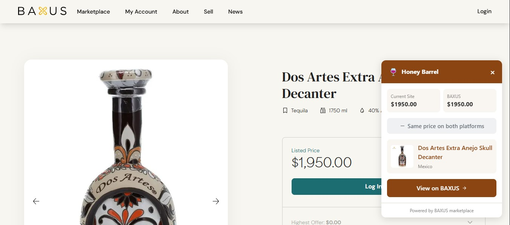
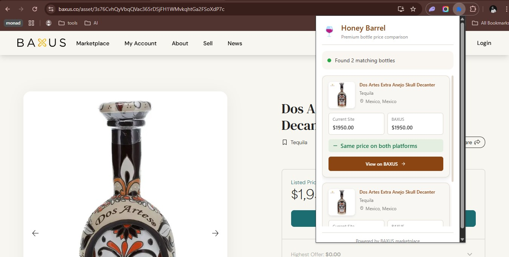
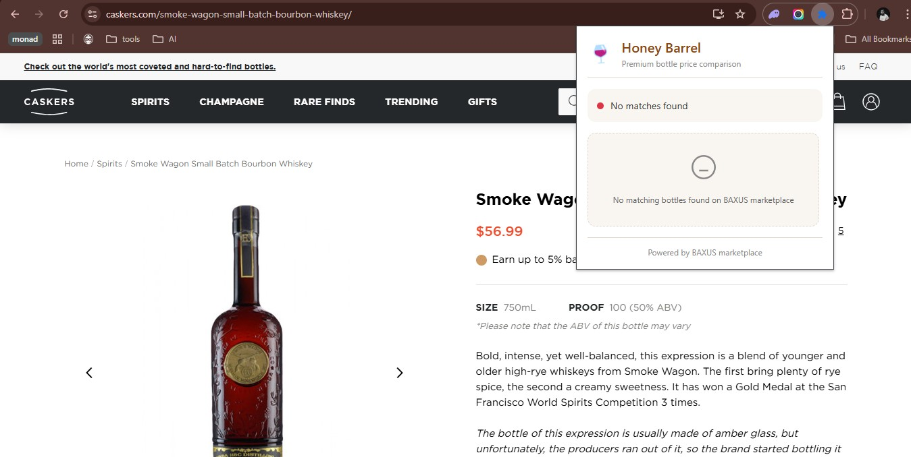
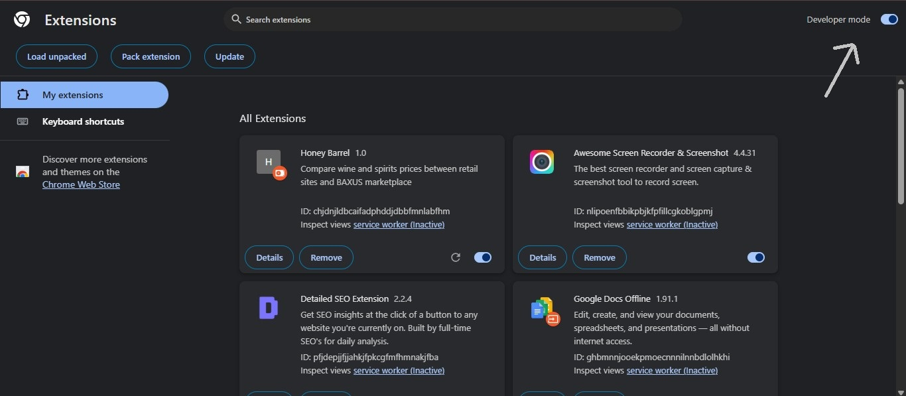
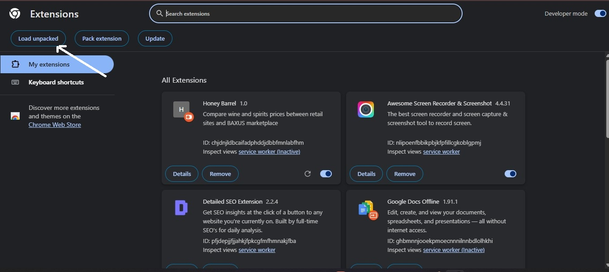
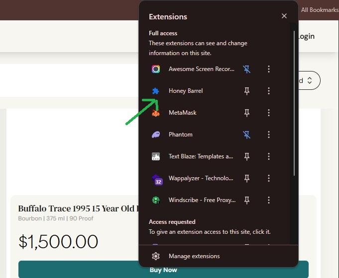

# Honey Barrel: Find the Best Price for Your Bottle using Baxus

Ever wondered if that bottle of whisky or wine you're looking at online is *really* a good deal?
Honey Barrel is a simple Chrome extension designed to help you quickly compare prices between popular online liquor retailers and the BAXUS marketplace, potentially saving you money!

## 🤔 Honey Barrel (Use Case)?

Finding the best deal for a bottle often means manually searching multiple places. Honey Barrel aims to simplify this by:

1   **Automating Price Checks:** Automatically looks up bottles you view on supported retail sites.

2   **Comparing with BAXUS:** Shows you the current listing prices on the BAXUS marketplace side-by-side.

3   **Saving You Time & Money:** Helps you spot potential savings without leaving the retailer's page.

##  Key Features Implemented

*   **Automatic Bottle Detection:** Identifies whisky and wine bottles as you browse supported sites.

*   **Real-time Price Comparison:** Fetches current listings from the BAXUS marketplace.

*   **On-Page Overlay:** Discreetly shows you the BAXUS price comparison right on the product page.
    *   
*   **Detailed Popup View:** Click the extension icon for more detailed information about matched bottles on BAXUS.
    *   
*   **Smart Matching:** Uses a clever algorithm to match bottle names, even if the spelling or description isn't exactly the same.

## Bottleneck (Issues that arose but were resolved)

1. **Finding the bottle on websites**: Most websites i came across while starting out didn't have the type of whiskeys and wines on baxus so i had to do a long search to find one

2. **Getting the elements for the images, prices and names**: this was relatively hard. most websites content are dynamic, so i think a future approach will be the use of AI to index the page

3. **Finding the item on baxus API**: I didnt find any suitable way to query the baxus api with a keyword e.g (https://services.baxus.co/api/search/listings?from=0&size=20&listed=true&q=whiskey), so i had to use filtering instead and fuzzy search and calculating similarity (Levenshtein distance based) seen in background.js

## How It Works

1.  **Install the Extension:** Follow the simple steps in the "Installation Guide" below.
2.  **Browse Supported Sites:** Visit a product page on a supported retail website (like `wine.com` or `caskers.com`).
3.  **Price Comparison:** If Honey Barrel recognizes the bottle, a small overlay will appear, showing you the price comparison with BAXUS listings.
    *   
4.  **Get More Details (Optional):** Click the Honey Barrel extension icon in your Chrome toolbar to see more detailed information about the matches found on BAXUS.
    *   

5.  **If item/bottle not found:** If the bottle is not found on the baxus marketplace it returns a nice message stating that
    *   

## 🛠️ Installation Guide (For Chrome)

Since this is currently under development, you'll need to load it manually. It's quick and easy:

1.  **Download the Code:**
    *   If you haven't already, clone or download the project files to a memorable location on your computer (e.g., your `Downloads` folder or a dedicated `Projects` folder).
2.  **Open Chrome Extensions:**
    *   Open your Google Chrome browser.
    *   Type `chrome://extensions/` into the address bar and press Enter.
3.  **Enable Developer Mode:**
    *   Look for the "Developer mode" toggle switch, usually in the top-right corner of the Extensions page, and turn it **ON**.
    *   
4.  **Load the Extension:**
    *   Click the "Load unpacked" button that appears (usually on the top-left).
    *   
    *   Navigate to the folder where you saved the Honey Barrel project files (the folder containing `manifest.json`, `background.js`, etc.).
    *   Select the main project folder (e.g., `Honey-Barrel`) and click "Select Folder".
5.  **Done!**
    *   The Honey Barrel extension should now appear in your list of extensions and its icon (🍯) should be visible in your Chrome toolbar (you might need to click the puzzle piece icon to pin it).
    *   

## ✅ Supported Retail Websites

Currently, Honey Barrel works best on:

*   `spiritory.com`
*   `wine.com`
*   `caskcartel.com`
*   `whiskey.auction`
*   `caskers.com`
* all currently supported websites are in the content.js though website content are prone to change (baxus.co is also supported too)

(Support for more sites may be added in the future!)

## A Little Technical Peek (Optional)

Curious how it works under the hood?

*   **Content Script (`content.js`):** This part runs directly on the retail websites. It scans the page to find bottle names and prices.
*   **Background Script (`background.js`):** This is the brain. It receives the bottle name from the content script, talks to the BAXUS API (`https://services.baxus.co/api/search/listings`) to find matching listings, and uses a similarity algorithm to figure out the best matches even if names aren't identical.
*   **Popup (`popup.html` / `popup.js`):** This creates the little window that appears when you click the extension icon, showing the detailed results.

## ⚠️ Disclaimer

*   Prices on BAXUS and retail sites can change frequently. Honey Barrel provides a snapshot comparison based on available data at the time of lookup.
*   The matching algorithm is smart but not perfect. Always double-check the bottle details (vintage, size, specific bottling) before making a purchase decision based on the comparison.
*   Honey Barrel is an independent tool and is not affiliated with BAXUS or any retail websites.

---
